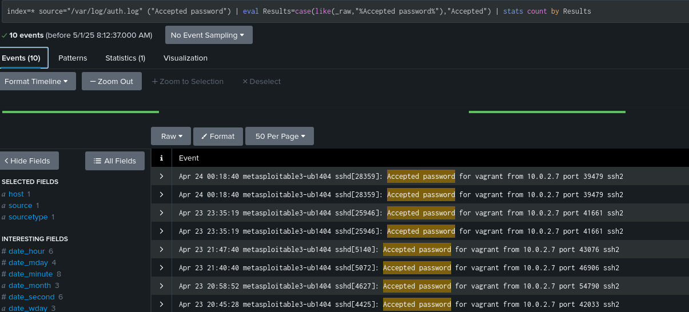

# Phase 2: Visual Analysis with a SIEM Dashboard

## Objective

Use a SIEM platform to collect and visualize data from the victim and the honeypot environments.

###  Forwarding the Server 

We chose to download the full Splunk on the Victim Machine instead of the universal Splunk forwarder. The command used to download splunk was as follows: 
```bash
wget -O splunk-9.2.1.deb 'https://download.splunk.com/products/splunk/releases/9.2.1/linux/splunk-9.2.1-abc123456789-linux-2.6-amd64.deb'
```

```bash
sudo /opt/splunk/bin/splunk add forward-server 10.0.2.15:9997
sudo /opt/splunk/bin/splunk add monitor /var/log/auth.log

```


### Log From The Victim Server
This is the /user/log/auth.log file on the victim machine, which is being forwarded to Splunk on the attacker machine. This file shows all the attacks that were made by the attacker's machine. 

```bash
sudo cat /user/log/auth.log

```


### Log From The Attacker Machine Splunk
This is the Splunk logs on the attacker machine. These logs show all the sessions that were opened and closed as well as all the attacks that were made including every username and password that was tried.  


### Visualization & Search Query
The search query used below is to show when there were attacks made and to be able to count the number of results in order to visualize it all.

```bash
index=* source="/var/log/auth.log" ("Failed password" OR "Accepted password")
| eval Results=case(like(_raw, "%Failed password%"), "Failed", like(_raw, "%Accepted password%"), "Accepted")
| stats count by Results

```


| Type | Count 
|----------|----------|
|Accepted   | 10  | 
|Failed   | 5889  | 

### Search Query For Accepted Only 
This search query was used to find only the accepted brute force attacks that were made. 

```bash
index=* source="/var/log/auth.log" ("Accepted password")
| eval Results=case(like(like(_raw, "%Accepted password%"), "Accepted")
| stats count by Results

```




### Analysis

From the Splunk visualization, it is evident that a very high number of brute-force attempts were made to compromise the victim machine. Out of over 5800 failed attempts, 10 logins were successfully accepted, indicating that the attacker was eventually able to guess valid credentials.

This kind of analysis demonstrates how SIEM tools like Splunk help detect malicious behavior by centralizing logs and providing powerful search and visualization capabilities. With this setup:

- We could identify both successful and failed brute-force attacks.

- We tracked every login attempt with time stamps and originating IPs.

- We validated the success of the attack using live forwarded logs.


