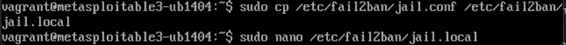
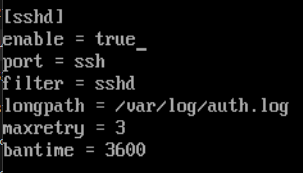
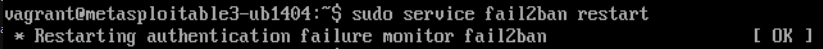
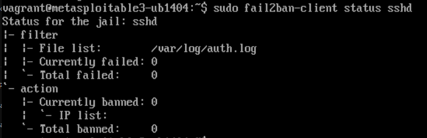
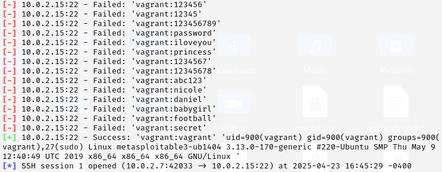
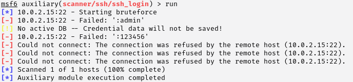
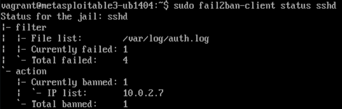

# Phase 3: Defensive Strategy Proposal

## Objective

To propose and implement a defensive strategy. Then, to test out the defense and show how the attack was before and after. We opted to go with a security tool installation as a defense mechanism. 

###  Download Fail2ban on Victim Machine

Fail2ban is an intrusion prevention software. We used this to try and prevent any brute force attacks. This software tries to look through logs to find any suspicious activity and bans hackers based on the pattern of their behavior. 

```bash
sudo apt update
sudo apt install fail2ban
```
###  Edit Jail Configuration File

```bash
sudo cp /etc/fail2ban/jail.conf /etc/fail2ban/jail.local
sudo nano /etc/fail2ban/jail.local
```



### Manually Adding SSHD Section
We added a SSHD section to the file to listen in on ssh connections and catch bad connections. This section basically shows that the maximum number of tries to log in is 3, and they can only try again after 1 hour and 40 minutes. 



Then, fail2ban must be restarted

```bash
sudo service fail2ban restart
```


### Status of Fail2ban Before Attack
Since there have been no attacks or banned IP addresses, the status is clear. 




### Attack from Attacker Machine

When we would attack the machine before, it would allow almost infinite tries into the victim machine, as shown below: 


After installing fail2ban, the number of brute force attacks is limited, as shown below:



The connection starts to fail because the victim machine bans the attacker machine's IP address from trying to log in. 


### Status of Fail2ban After Attack
we can clearly see that the attacker machine has been banned which has stopped any further brute force attempts.




